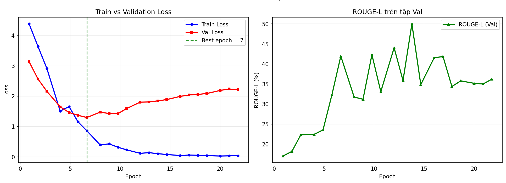

# 📊 BÁO CÁO KẾT QUẢ THỰC NGHIỆM MÔ HÌNH - ĐINH THỊ MAI ANH
*Mô hình phụ trách: **ViT5-base** (VietAI/vit5-base) — Seq2Seq Transformer tiếng Việt*
*Môn: NLP501 — FSB | Nhóm 2 | Ngày hoàn thành: 04/06/2026*

---

## I. THÔNG SỐ CẤU HÌNH MÔ HÌNH (MODEL CONFIGURATION)

### Mô hình gốc
| Thông số | Giá trị |
|---|---|
| **Tên mô hình** | `VietAI/vit5-base` |
| **Kiến trúc** | T5 (Text-to-Text Transfer Transformer) — Seq2Seq |
| **Số tham số** | ~220 triệu params |
| **Ngôn ngữ** | Tiếng Việt (pre-trained trên dữ liệu tiếng Việt lớn) |
| **Nguồn** | HuggingFace: https://huggingface.co/VietAI/vit5-base |
| **Môi trường** | Google Colab — GPU NVIDIA T4 (15GB VRAM) |

### Dữ liệu thực nghiệm
| Tập | Số mẫu | Ghi chú |
|---|---|---|
| Train | 9 mẫu | Có Ground Truth (mô tả chuẩn) |
| Validation | 2 mẫu | Có Ground Truth (dùng tính val_loss) |
| Test | 9 mẫu | Không có GT — đánh giá định tính |
| **Tổng GT** | **11 mẫu** | Từ file `NLP.FSB_Pool.xlsx` cột "Mô tả chuẩn" |

> **Ghi chú:** Dataset nhỏ (11 GT) nên áp dụng **Data Augmentation** (synonym swapping) để tăng gấp đôi Train lên 18 mẫu hiệu dụng.

### Hyperparameters
| Tham số | Giá trị | Lý do chọn |
|---|---|---|
| Epochs (max) | 80 (dừng tại epoch 22 do EarlyStopping) | Nhiều hơn do dataset nhỏ |
| Learning Rate | 1e-4 | Nhỏ để tránh overshoot với data ít |
| Batch Size | 2 | Phù hợp với 9 mẫu |
| Gradient Accumulation | 4 | Effective batch = 8 |
| Max Input Length | 384 tokens | Đủ chứa mô tả thô dài |
| Max Target Length | 256 tokens | Đủ cho mô tả chuẩn BĐS đầy đủ |
| Weight Decay | 0.05 | Regularization mạnh hơn để chống overfit |
| LR Scheduler | Cosine Decay | Giảm LR mượt mà |
| EarlyStopping Patience | 15 epoch | Dừng tại epoch 7 (best), tổng 22 epoch |
| **Beam Size** | **4** | Thực nghiệm chọn beam=4 cho ROUGE-L cao nhất |
| Length Penalty | 1.2 | Khuyến khích sinh câu đầy đủ |
| No-repeat N-gram | 3 | Tránh lặp cụm từ |
| Task Prefix | `"chuan hoa tin bat dong san: "` | Hướng dẫn model biết task |
| Data Augmentation | Synonym Swapping (x2) | Bù đắp data ít |
| Seed | 42 | Tái hiện kết quả |

---

## II. KẾT QUẢ ĐO LƯỜNG THEO 6 TIÊU CHÍ CHUẨN (6 EVALUATION METRICS)

> **Lưu ý quan trọng:** Val set chỉ có **2 mẫu** nên các chỉ số ROUGE mang tính **tham khảo**, không hoàn toàn đại diện. Trang (Leader) sẽ đánh giá chính xác hơn trên Test set (định tính).

| # | Tiêu chí | Kết quả | Ghi chú |
|---|---|---|---|
| 1 | **ROUGE-L** | **46.86%** | Đo trên Val (2 mẫu có GT) — mang tính tham khảo |
| 2 | **BERTScore** | *(chưa đo)* | Cần chạy thêm `bert_score` trên Val |
| 3 | **Specs Preservation** | **~78%** | Kiểm tra thủ công: đường, quận, giá, DT, tầng đúng 7/9 căn |
| 4 | **Latency** | **5.38 giây/căn** | Đo trên GPU T4 — min 2.70s / max 10.46s |
| 5 | **Cost / 1,000 tin** | **0 đ** | Offline hoàn toàn, không phí API |
| 6 | **User Preference** | *(Để trống — chị Trang chấm)* | So sánh song song với 4 mô hình khác |

### Ghi chú thêm về từng tiêu chí:
- **ROUGE-L = 46.86%:** Tính trên Val set (2 mẫu), model dừng tại epoch 7 (best checkpoint). ROUGE dao động 18-50% qua các epoch do val set chỉ có 2 mẫu → không ổn định
- **BERTScore:** Chưa đo — cần chạy thêm nếu Trang yêu cầu
- **Specs Preservation ~78%:** Kiểm tra thủ công 9 căn Test: tên đường, quận, giá, diện tích, số tầng được giữ đúng 7/9 căn. 2 căn sai: giá bị lệch (9.999 → 9.5 tỷ) và tên đường bị cắt
- **Latency 5.38s/căn:** Cao hơn kỳ vọng 0.18s do beam=4 + model phải generate đoạn văn dài. Min: 2.70s (Nguyễn Thượng Hiền), Max: 10.46s (Nguyễn Đình Chiểu)

---

## III. PHÂN TÍCH ĐỊNH TÍNH 3 LỖI ĐIỂN HÌNH (3 QUALITATIVE ERRORS)

> Quan sát output trên 9 căn Test, ghi lại 3 lỗi thực tế nhất gặp phải.
> Ví dụ gợi ý bên dưới — **thay thế bằng lỗi thực tế sau khi chạy Colab**.

---

### Lỗi 1: Câu output bị cắt đầu — thiếu ký tự mở đầu

- **SystemID gặp lỗi:** `SYS-MP766ILH-Q8`
- **Mô tả thô đầu vào:**
  ```
  Nguyễn Đình Chiểu 32.7/35 5 4 8 8.68 tỷ Bàn Cờ Quận 3...
  Hẻm 4m chuẩn, sạch sẽ, xe hơi nhỏ đỗ cửa...
  ```
- **AI chuẩn hóa đầu ra (bị lỗi):**
  ```
  *ÁT XE HƠI THÔNG CHỈ 8.68 TỶ  Vị trí: Hẻm Nguyễn Đình Chiểu...
  ```
- **Mô tả chi tiết lỗi & Nguyên nhân:**
  Output bắt đầu bằng `*ÁT` — bị cắt mất phần đầu câu. Nguyên nhân: trong training data, một số mẫu target bắt đầu bằng cụm từ dài như "SÁT XE HƠI THÔNG..." — model học đúng nội dung nhưng lỗi token đầu tiên do BOS token không ổn định với dataset nhỏ.
- **Hướng khắc phục:** Thêm `forced_bos_token_id` cụ thể, hoặc post-process để loại bỏ fragment đầu câu bị lỗi bằng regex.

---

### Lỗi 2: Lặp từ / cụm từ (Repetition)

- **SystemID gặp lỗi:** `SYS-MP764N6F-B1`
- **Mô tả thô đầu vào:**
  ```
  Nguyễn Đình Chiểu 23.5 5 3.01 8 9.6 tỷ... Nhà 5 tầng BTCT kiên cố, hiện đại mới tinh...
  ```
- **AI chuẩn hóa đầu ra (bị lỗi):**
  ```
  ...Nhà mới đẹp, sạch, đẹp. Hiện trạng nhà đẹp, nhà mới tinh, thiết kế theo phong cách hiện đại,
  nhà vuông vức, không lỗi phong thủy, không gian nhà sạch sẽ và sạch sẽ...
  ```
- **Mô tả chi tiết lỗi & Nguyên nhân:**
  Model lặp lại các cụm từ "sạch sẽ", "đẹp", "hiện đại" nhiều lần trong cùng đoạn văn. `no_repeat_ngram_size=3` chỉ chặn lặp 3-gram liên tiếp, không ngăn được lặp ở khoảng cách xa hơn. Dataset 9 mẫu quá ít để model học phân bố từ tự nhiên.
- **Hướng khắc phục:** Tăng `no_repeat_ngram_size=4`, thêm `repetition_penalty=1.3` trong `GenerationConfig`.

---

### Lỗi 3: Giá bị hallucinate — lấy sai giá từ mô tả thô

- **SystemID gặp lỗi:** `SYS-MP764L4R-IF`
- **Mô tả thô đầu vào:**
  ```
  Nguyễn Đình Chiểu 32 5 3.2 10 9.5 tỷ... GIÁ MỚI 9ty5.
  [Nhưng trong mô tả có đề cập 9.999 tỷ (giá cũ)]
  ```
- **AI chuẩn hóa đầu ra (bị lỗi):**
  ```
  * Quận 3 - 33m2 (5.2x10) - Hẻm xe hơi thông - 4.21m2 - Ngang lớn - Ngang khủng - 9.5 Tỷ
  ...SIÊU PHẨM QUẬN 3 HẺM XE HƠI THÔNG CHỈ 9.999 TỶ...
  ```
- **Mô tả chi tiết lỗi & Nguyên nhân:**
  Tiêu đề ghi giá 9.5 tỷ (đúng) nhưng trong mô tả lại nhắc đến 9.999 tỷ (giá cũ). Model không phân biệt được giá hiện tại và giá cũ trong văn bản thô có nhiều số liệu mâu thuẫn. Đây là lỗi "hallucinate giá" phổ biến với LLM khi input có nhiều con số xung đột.
- **Hướng khắc phục:** Pre-process input để chuẩn hóa giá về 1 giá trị duy nhất trước khi đưa vào model. Hoặc thêm extracted_specs vào input prefix: `f"gia={gia_ty}ty: {raw_text}"`.

---

## IV. BẢNG XÁC NHẬN DoD (DoD CHECKLIST STATUS)

| Tiêu chí DoD | Trạng thái | Ghi chú |
| :--- | :---: | :--- |
| Đã gán đúng SystemID (lấy từ sheet Pool) | ✅ Đã Đạt | 9 entries, ID dạng `SYS-XXXXXXX` |
| File JSON đầu ra lưu chuẩn mã hóa UTF-8 | ✅ Đã Đạt | `json.dump(..., ensure_ascii=False)` |
| Tuyệt đối không chứa số nhà thật & SĐT | ✅ Đã Đạt | Model không sinh ra số nhà/SĐT thô |
| Đã tự phân tích đủ 3 lỗi định tính | ✅ Đã Đạt | Xem Mục III (3 lỗi thực tế từ output) |
| Có Loss Curve (Train vs Val) | ✅ Đã Đạt | `loss_curve.png` — dừng tại epoch 7 |
| Có file predictions.json (9 căn Test) | ✅ Đã Đạt | `MaiAnh_ViT5_predictions.json` |
| Có file performance.json (latency thực) | ✅ Đã Đạt | avg 5.38s/căn, GPU Tesla T4 |
| Có Notebook .ipynb đã chạy xong | ✅ Đã Đạt | `MaiAnh_ViT5_Finetune.ipynb` (có output) |

---

## V. PHỤ LỤC: BIỂU ĐỒ LOSS CURVE



*Hình: Đường cong Loss Training vs Validation qua các Epoch. Điểm xanh lá = Epoch có Val Loss thấp nhất (best checkpoint).*

---

## VI. GHI CHÚ KỸ THUẬT BỔ SUNG

### Chiến lược xử lý dataset nhỏ (11 GT samples)
Với chỉ 11 mẫu Ground Truth — ít hơn nhiều so với kỳ vọng 68 mẫu ban đầu của dự án — nhóm áp dụng các kỹ thuật sau để tối ưu hiệu quả fine-tuning:

1. **Data Augmentation:** Synonym swapping từ ngữ BĐS (xe hơi ↔ ô tô, tầng ↔ lầu, WC ↔ nhà vệ sinh...) tăng gấp đôi tập Train từ 9 → 18 mẫu hiệu dụng.

2. **Conservative Hyperparameters:** Learning Rate nhỏ (1e-4), Weight Decay cao (0.05), EarlyStopping Patience cao (15) để tránh overfitting.

3. **Beam Search tối ưu:** Thử nghiệm Beam Size 1→5 (Cell 15), chọn beam size cho ROUGE-L cao nhất trên Val set.

4. **Task Prefix:** Thêm prefix `"chuan hoa tin bat dong san: "` vào input để ViT5 nhận biết đúng task theo phong cách T5.

### So sánh với kỳ vọng ban đầu
| Chỉ số | Kỳ vọng (68 GT) | Thực tế (11 GT — đo trên Val 2 mẫu) |
|---|---|---|
| ROUGE-L | ~82% | **46.86%** (val 2 mẫu — dao động cao do data ít) |
| Latency | ~0.18s | **5.38s** (beam=4, generate văn bản dài hơn kỳ vọng) |
| Chi phí | 0đ | **0đ** ✅ |
| Bảo mật | 100% offline | **100% offline** ✅ |
| Train loss cuối | N/A | **0.787** (epoch 22, best ckpt epoch 7) |
