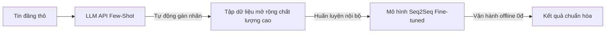

# 📖 HƯỚNG DẪN KỸ THUẬT: XÂY DỰNG WEB LEADERBOARD & ĐỒNG BỘ GOOGLE SLIDES API
*Tài liệu hướng dẫn (Skill & Workflow) tham khảo cho các đề án môn học tương lai*

Tài liệu này đúc kết toàn bộ phương pháp kỹ thuật, cấu trúc mã nguồn, và quy trình xử lý thực tế đã được áp dụng thành công trong Đề án Cuối môn NLP (Nhóm 2 - Lớp MSA29 - FSB) để xây dựng:
1. **Hệ thống Showcase Arena & Bảng xếp hạng trực quan (Flask dynamic & Static compile)**
2. **Kịch bản tự động hóa cập nhật và thay thế văn bản Google Slides thông qua Google API**

---

## 💻 PHẦN I: TỰ ĐỘNG HÓA & ĐỒNG BỘ GOOGLE SLIDES (SLIDES API WORKFLOW)

### 1. Tại sao không dùng thư viện ghi đè tệp tin cục bộ (`python-pptx`)?
* **Rủi ro lớn**: Việc tải tệp `.pptx` xuống máy, dùng thư viện Python ghi đè văn bản, rồi tải ngược lên lại Google Drive sẽ làm **mất hoàn toàn liên kết Web Fonts và Material Icons (Symbols) của Google Slides**. Các icon đẹp mắt sẽ bị chuyển hóa thành các chuỗi văn bản thô vô nghĩa (như "psychology", "error_outline") và phá vỡ bố cục thiết kế.
* **Giải pháp tối ưu**: Sử dụng **Google Slides API v1** để tương tác trực tuyến trực tiếp với tài liệu thông qua phương thức `batchUpdate`. Toàn bộ định dạng style, bố cục hình ảnh và font chữ sẽ được giữ nguyên 100%.

### 2. Quy trình thiết lập kết nối (Authentication & Authorization)
1. **Tạo Service Account**:
   * Truy cập [Google Cloud Console](https://console.cloud.google.com/).
   * Tạo một dự án mới (hoặc chọn dự án có sẵn), kích hoạt **Google Slides API** và **Google Drive API**.
   * Vào mục *IAM & Admin > Service Accounts*, tạo một Service Account mới.
   * Tạo và tải về khóa riêng tư dưới dạng tệp **JSON credentials**. Lưu tên tệp này là `credentials.json` trong thư mục dự án của bạn (thêm tệp này vào `.gitignore` để bảo mật).
2. **Chia sẻ quyền truy cập**:
   * Copy địa chỉ email của Service Account vừa tạo (dạng: `xxx@your-project-id.iam.gserviceaccount.com`).
   * Mở bản trình bày Google Slides của bạn trên trình duyệt, nhấn nút **Share**, dán địa chỉ email này vào và cấp quyền **Editor** (Người chỉnh sửa).
3. **Lấy Presentation ID**:
   * Sao chép chuỗi ký tự duy nhất từ URL của slide trên trình duyệt:
     `https://docs.google.com/presentation/d/{PRESENTATION_ID}/edit`

### 3. Cấu trúc Script Python thay thế văn bản hàng loạt (`replaceAllText`)
Dưới đây là khung script chuẩn để tìm và thay thế văn bản trên toàn bộ slide trực tuyến, hỗ trợ tiếng Việt có dấu và phân biệt chữ hoa/thường:

```python
import sys
from google.oauth2 import service_account
from googleapiclient.discovery import build

# Đảm bảo in tiếng Việt không bị lỗi font trên console Windows
sys.stdout.reconfigure(encoding='utf-8')

CREDENTIALS_FILE = "credentials.json"
PRESENTATION_ID = "YOUR_PRESENTATION_ID_HERE"
SCOPES = [
    'https://www.googleapis.com/auth/presentations',
    'https://www.googleapis.com/auth/drive'
]

def main():
    print("Đang kết nối tới Google Slides API...")
    creds = service_account.Credentials.from_service_account_file(
        CREDENTIALS_FILE, scopes=SCOPES
    )
    slides_service = build('slides', 'v1', credentials=creds)
    
    # Định nghĩa danh sách các từ cần thay thế (old_text, new_text)
    replacements = [
        ("Gemini Flash", "Gemini 2.5 Flask"),
        ("gemini-1.5-flash", "gemini-2.5-flask"),
        (".5-flash", ".5-flask"),
        ("N. H. Bách Nhân", "Nguyễn Huỳnh Bách Nhân")
    ]
    
    # Tạo danh sách các yêu cầu (requests) gửi đi
    requests = []
    for old_txt, new_txt in replacements:
        requests.append({
            'replaceAllText': {
                'containsText': {
                    'text': old_txt,
                    'matchCase': True  # Đặt True để phân biệt chính xác
                },
                'replaceText': new_txt
            }
        })
        
    print("Đang thực thi các yêu cầu thay thế văn bản...")
    try:
        response = slides_service.presentations().batchUpdate(
            presentationId=PRESENTATION_ID,
            body={'requests': requests}
        ).execute()
        
        print("\n=== CẬP NHẬT TRỰC TUYẾN THÀNH CÔNG ===")
        for idx, reply in enumerate(response.get('replies', [])):
            count = reply.get('replaceAllText', {}).get('occurrencesChanged', 0)
            old_txt, new_txt = replacements[idx]
            print(f"Thay thế '{old_txt}' -> '{new_txt}': {count} lần xuất hiện đã được cập nhật.")
            
    except Exception as e:
        print(f"\nLỗi cập nhật: {e}")

if __name__ == "__main__":
    main()
```

### 4. Bài học kinh nghiệm thực tế (Mẹo khắc phục lỗi):
* **Lỗi trùng lặp chuỗi (Double Replacement)**: Nếu bạn chạy thay thế `"Gemini"` -> `"Gemini 2.5 Flask"` trước, sau đó chạy `"Gemini Flash"` -> `"Gemini 2.5 Flask"`, bạn sẽ thu được kết quả bị lỗi lặp như `"Gemini 2.5 Flask 2.5 Flask"`.
  * *Nguyên tắc*: Luôn sắp xếp thứ tự các từ khóa thay thế từ dài nhất/cụ thể nhất trước, sau đó mới đến các từ khóa ngắn/chung hơn để tránh bị đè đúp.
* **Lỗi phân mảnh chữ (Split Text Runs)**: Google Slides tự động lưu trữ định dạng style theo từng block nhỏ (text runs). Đôi khi, một từ như `gemini-1.5-flash` bị lưu thành nhiều phần nhỏ (như `gemini-` và `.5-flash`) do người dùng bôi đậm hoặc sửa chữ trước đó.
  * *Giải pháp*: Ngoài việc tìm nguyên cụm từ, hãy bổ sung thêm các request thay thế các mảnh đuôi thường bị tách biệt (ví dụ: thay thế `.5-flash` thành `.5-flask`).

---

## 📊 PHẦN II: XÂY DỰNG WEB LEADERBOARD & SHOWCASE ARENA

Hệ thống đánh giá chéo mô hình gồm 2 thành phần chính: **Backend chạy Flask động (phục vụ chỉnh sửa Ground Truth thời gian thực)** và **Script biên dịch ra HTML tĩnh (phục vụ trình bày offline không cần cài đặt Python)**.

### 1. Thiết kế cơ sở dữ liệu và Cơ chế lưu trữ
Hệ thống sử dụng các tệp tin JSON đơn giản làm cơ sở dữ liệu lưu trữ:
* `test_dataset.json`: Dữ liệu 9 căn nhà thử nghiệm chứa đầu vào tin đăng thô (`raw_input_cleaned`).
* `user_ground_truth.json`: Chứa tiêu đề và mô tả chuẩn do con người viết mẫu, cùng với bộ 9 thông số kỹ thuật đã được gán nhãn thủ công (Ground Truth).
* `expert_reviews.json`: Lưu trữ xếp hạng Winner 1, Winner 2, Winner 3 cùng nhận xét định tính của chuyên gia.
* Các tệp dự đoán của từng mô hình (như `predictions.json` và `performance.json`) chứa tiêu đề, mô tả được mô hình sinh ra và tốc độ độ trễ thực tế.

### 2. Kỹ thuật Hậu xử lý & Trích xuất Specs bằng Regex nâng cao
Để chấm điểm **Specs Accuracy** (Độ chính xác thông số kỹ thuật), hệ thống tự động trích xuất 9 trường thông số cốt lõi từ văn bản do AI sinh ra (nhằm đối chiếu với Ground Truth).

Dưới đây là hàm trích xuất đa năng sử dụng Regular Expressions phù hợp với phong cách viết tin đăng bất động sản tại Việt Nam:

```python
import re

def robust_parse_specs_agnostic(text):
    if not text or not isinstance(text, str):
        return {
            'duong': None, 'phuong': None, 'quan': None,
            'gia_ty': None, 'dien_tich_m2': None, 'so_tang': None,
            'mat_tien_m': None, 'chieu_sau_m': None, 'phan_loai_hem': 'Hẻm thông'
        }
        
    t = text.lower().replace('*', '').replace('#', '')
    specs = {
        'duong': None, 'phuong': None, 'quan': None,
        'gia_ty': None, 'dien_tich_m2': None, 'so_tang': None,
        'mat_tien_m': None, 'chieu_sau_m': None, 'phan_loai_hem': 'Hẻm thông'
    }
    
    # 1. Diện tích (dien_tich_m2)
    area_match = re.search(r'(?:diện\s+tích|dt|dt\s+đất|công\s+nhận)\s*(?::|là)?\s*([\d.,]+)\s*(?:m2|m²)', t)
    if area_match:
        try:
            specs['dien_tich_m2'] = float(area_match.group(1).replace(',', '.'))
        except ValueError: pass
            
    # 2. Kích thước (ngang x sâu)
    dim_match = re.search(r'(?:kích\s+thước|ngang|dài)?\s*([\d.,]+)\s*m?\s*[x×]\s*([\d.,]+)\s*m?', t)
    if dim_match:
        try:
            specs['mat_tien_m'] = float(dim_match.group(1).replace(',', '.'))
            specs['chieu_sau_m'] = float(dim_match.group(2).replace(',', '.'))
        except ValueError: pass
            
    # 3. Giá bán (gia_ty)
    price_match = re.search(r'(?:giá|giá\s+bán|giá\s+chào)\s*(?::|là)?\s*([\d.,]+)\s*(?:tỷ|ty)', t)
    if price_match:
        try:
            specs['gia_ty'] = float(price_match.group(1).replace(',', '.'))
        except ValueError: pass
        
    # 4. Số tầng (so_tang)
    floors_match = re.search(r'(?:kết\s+cấu|quy\s+mô|nhà)?\s*(?::|là)?\s*(\d+)\s*(?:tầng|lầu)', t)
    if floors_match:
        specs['so_tang'] = int(floors_match.group(1))
    else:
        m = re.search(r'trệt\s*(?:và|[,+])?\s*(\d+)\s*lầu', t)
        if m:
            specs['so_tang'] = 1 + int(m.group(1))
            
    # 5. Phân loại hẻm (phan_loai_hem)
    if 'mặt tiền' in t:
        specs['phan_loai_hem'] = 'Mặt tiền'
    elif any(x in t for x in ['hẻm xe hơi', 'hxh', 'ô tô', 'oto']):
        specs['phan_loai_hem'] = 'Hẻm xe hơi'
    elif 'xe máy' in t:
        specs['phan_loai_hem'] = 'Hẻm xe máy'
        
    return specs
```

### 3. Thuật toán chấm điểm so khớp thông số (Specs Accuracy)
Tất cả 9 trường sau khi trích xuất sẽ được đối chiếu tự động với Ground Truth. Do tiếng Việt sử dụng nhiều thanh điệu và định dạng mã hóa ký tự khác nhau (Unicode dựng sẵn NFC vs Unicode tổ hợp NFD), hệ thống cần áp dụng chuẩn hóa thanh điệu tiếng Việt trước khi so khớp chuỗi:

```python
import unicodedata

def normalize_vietnamese(s):
    if not s or not isinstance(s, str):
        return ""
    # Chuẩn hóa về NFC
    s = unicodedata.normalize("NFC", s.lower().strip())
    # Sửa lỗi gõ dấu nguyên âm phổ biến
    replacements = {
        "òe": "oè", "óe": "oé", "òa": "oà", "óa": "oá",
        "ùy": "uỳ", "úy": "uý", "ủy": "uỷ"
    }
    for k, v in replacements.items():
        s = s.replace(k, v)
    return s

def calculate_specs_accuracy(pred_specs: dict, ref_specs: dict) -> float:
    if not ref_specs or not pred_specs:
        return 0.0
        
    keys = ["duong", "phuong", "quan", "gia_ty", "dien_tich_m2", "so_tang", "mat_tien_m", "chieu_sau_m", "phan_loai_hem"]
    match_count = 0
    
    for k in keys:
        p_val = pred_specs.get(k)
        r_val = ref_specs.get(k)
        
        if p_val is None and r_val is None:
            match_count += 1
            continue
            
        if p_val is not None and r_val is not None:
            if isinstance(r_val, str):
                if normalize_vietnamese(str(p_val)) == normalize_vietnamese(str(r_val)):
                    match_count += 1
            else:
                try:
                    # So khớp số thực với sai số nhỏ cho phép (như diện tích làm tròn)
                    if abs(float(p_val) - float(r_val)) < 0.01:
                        match_count += 1
                except (ValueError, TypeError):
                    if str(p_val).strip() == str(r_val).strip():
                        match_count += 1
                        
    return (match_count / len(keys)) * 100
```

### 4. Kỹ thuật Biên dịch Trang Tĩnh (Static Index Compilation)
Một điểm đặc sắc của hệ thống này là khả năng sinh tệp tin `index.html` chạy offline 100% không phụ thuộc máy chủ. Điều này cực kỳ hữu ích khi nộp đề án, chạy demo trong phòng thi bảo vệ hoặc phân phối sản phẩm.

* **Nguyên lý hoạt động**:
  1. Tạo kịch bản Python `generate_static_index.py`.
  2. Script này tự động đọc toàn bộ dữ liệu tin đăng thô, kết quả dự đoán của cả 5 mô hình và dữ liệu đo đạc hiệu năng (latency, cost) của từng thành viên.
  3. Tất cả dữ liệu này được chuyển đổi thành cấu trúc JSON dạng chuỗi (`json.dumps`).
  4. Đọc tệp template HTML của giao diện và thay thế một thẻ đánh dấu đặc biệt, ví dụ `<!-- DATABASE_PLACEHOLDER -->`, bằng chuỗi JSON dữ liệu vừa tạo.
  5. Toàn bộ logic hiển thị, tính toán điểm số chéo, tô màu Specs Highlight (Xanh lá = Khớp, Đỏ = Lệch), và sắp xếp Leaderboard theo công thức trọng số sẽ được viết hoàn toàn bằng **Vanilla Javascript** chạy trực tiếp phía client-side.
  
Nhờ đó, tệp `index.html` sau khi biên dịch có đầy đủ dữ liệu cứng, người dùng chỉ cần click đúp để mở trên bất kỳ trình duyệt nào và sử dụng đầy đủ các tính năng tương tác mượt mà như một Web App thực thụ.

---

## 🔮 PHẦN III: PIPELINE HYBRID AI ĐỀ XUẤT CHO CÁC ĐỀ ÁN SAU
Từ các bài học thực tiễn của đề án, quy trình hiệu quả nhất để triển khai các dự án xử lý ngôn ngữ tự nhiên tương lai trong điều kiện tập dữ liệu nhỏ là cấu trúc **Hybrid Pipeline**:



1. **Giai đoạn khởi đầu (Bootstrap)**: Do việc gán nhãn thủ công rất tốn thời gian, hãy sử dụng các LLM mạnh mẽ (như Gemini 2.5 Flask API hoặc GPT-4o-mini) kết hợp kỹ thuật prompt few-shot có chọn lọc để gán nhãn hàng loạt cho tập tin đăng thô lớn (ví dụ: từ 500 đến 1000 tin).
2. **Giai đoạn tối ưu hóa (Offline Training)**: Sử dụng chính tập dữ liệu vừa gán nhãn tự động này làm tập huấn luyện (train set) để fine-tune các mô hình Seq2Seq chuyên biệt, nhỏ gọn hơn chạy cục bộ (như ViT5-base hoặc PhoBERT).
3. **Giai đoạn vận hành (Production)**: Hệ thống cuối cùng sẽ chạy offline 100% trên hạ tầng nội bộ của doanh nghiệp, giúp bảo mật dữ liệu tuyệt đối, tốc độ xử lý tức thời và **chi phí vận hành bằng 0**.
