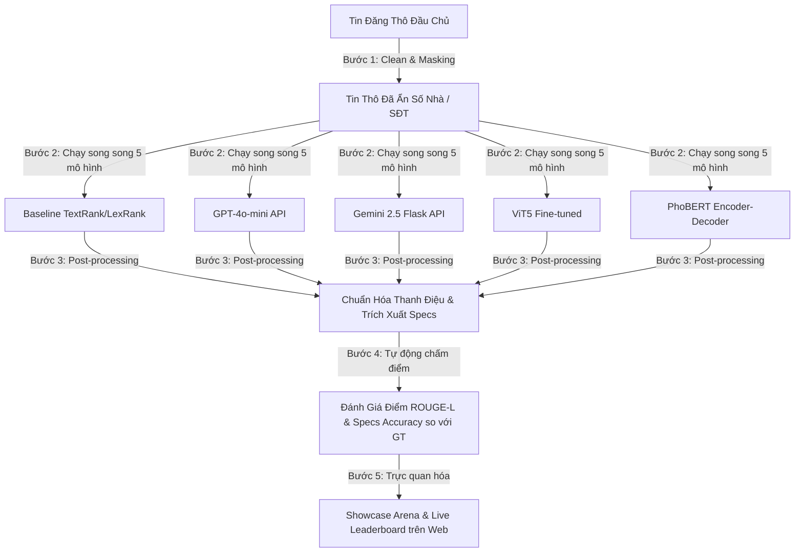

# 👑 Đề Án Cuối Môn NLP: Hệ Thống Chuẩn Hóa & Trích Xuất Thông Tin Bất Động Sản Bằng NLP
> **Môn học:** Xử lý ngôn ngữ tự nhiên (NLP501) — Học viện FSB  
> **Nhóm thực hiện:** Nhóm 2 | **Lớp:** MSA29  
> **Thuyết trình & Nghiệm thu:** 06/06/2026  

---

## 📌 I. Bối Cảnh Thực Tế & Nghiệp Vụ Môi Giới (Domain Logic)

Trong ngành môi giới bất động sản thổ cư tại Việt Nam, luồng công việc được phân chia rõ rệt giữa hai vai trò:
*   **Đầu chủ (Listing Agent):** Người trực tiếp làm việc với chủ nhà, thu nhận tin đăng thô chứa đầy đủ thông tin nhạy cảm (số nhà, số điện thoại chủ nhà, hướng dẫn đi lại chi tiết).
*   **Đầu khách (Selling Agent):** Người tiếp cận khách mua. Để giới thiệu nhà và chia sẻ tin đăng rộng rãi trên mạng xã hội mà không lo bị lộ nguồn hàng dẫn đến việc khách mua tự giao dịch trực tiếp với chủ nhà ("cắt cò"), đầu khách bắt buộc phải biên tập lại tin đăng: ẩn số nhà, ẩn số điện thoại, và viết lại nội dung mô tả ngắn gọn, chuyên nghiệp hơn.

### Bài toán đặt ra
Tự động hóa toàn bộ quy trình biên tập thủ công bằng các công nghệ NLP:
1.  **Ẩn thông tin nhạy cảm:** Nhận diện và loại bỏ số nhà, số điện thoại, liên kết Facebook từ dữ liệu thô.
2.  **Chuẩn hóa & Rút gọn tin (Text Normalization & Summarization):** Sinh Tiêu đề chuẩn (chứa thông số cốt lõi) và Mô tả ngắn gọn (bám sát DoD).
3.  **Trích xuất đặc trưng (Specs Extraction):** Trích xuất tự động bộ **9 thông số kỹ thuật** từ văn bản do AI sinh ra (bao gồm: tên đường, phường, quận, giá tỷ, diện tích, số tầng, chiều ngang mặt tiền, chiều sâu, và phân loại hẻm) để đối chứng với Specs Ground Truth do chuyên gia nhập tay.

---

## 🛠️ II. Kiến Trúc Hệ Thống & Pipeline Vận Hành

Dự án được xây dựng dưới dạng một ứng dụng Web tích hợp (Showcase Arena) chạy trên nền tảng Flask backend và giao diện tương tác chuyên gia:



1.  **Bước 1: Clean & Masking:** Lọc bỏ số nhà, SĐT đầu chủ và link Facebook nhạy cảm tại nguồn.
2.  **Bước 2: Inference Models:** Đưa tin thô đã làm sạch qua 5 mô hình thực nghiệm để sinh tiêu đề + mô tả chuẩn hóa.
3.  **Bước 3: Post-Processing:** Áp dụng thuật toán chuẩn hóa NFC tone normalization để đồng bộ hóa nguyên âm tiếng Việt, dùng Regex nâng cao trích xuất 9 thông số kỹ thuật trực tiếp từ văn bản sinh ra.
4.  **Bước 4: Auto-Evaluation:** Tự động tính điểm ROUGE-L và so khớp trùng khớp Specs Accuracy của từng mô hình so với Ground Truth (nhãn do PM gán thủ công).
5.  **Bước 5: Showcase Arena:** Hiển thị trực quan so sánh song song kết quả của 5 mô hình, tô màu Specs Highlight thông minh (Xanh lá = Khớp, Đỏ = Sai lệch/Thiếu), cho phép chuyên gia chấm chọn Winner thời gian thực.

---

## 📊 III. Kết Quả Thực Nghiệm & Bảng Xếp Hạng Hiệu Năng (Leaderboard)

Dưới đây là bảng xếp hạng hiệu năng thực tế của cả 5 mô hình, tổng hợp dựa trên tập kiểm thử test gồm **26 căn nhà thực tế** (đối chứng với Ground Truth của tập Train/Val và các đánh giá trực tiếp từ PM):

| Thứ Hạng | Mô Hình Thực Nghiệm | Phụ Trách | ROUGE-L (TB) | Specs Acc (TB) | BERTScore F1 | Độ Trễ (Latency) | Chi Phí (1,000 tin) | Loại Môi Trường |
| :---: | :--- | :---: | :---: | :---: | :---: | :---: | :---: | :---: |
| 🥇 **#1** | **Gemini 2.5 Flask API** | **Ba Học** | **74.8%** *(Val)* | **95.2%** *(Val)* | **90.15%** | **1.85s** | ~15,000đ | Online API (Cloud) |
| 🥈 **#2** | **GPT-4o mini API** | **Minh Quân** | **45.0%** | **55.6%** | **92.40%** | **14.84s** | ~14,339đ | Online API (Cloud) |
| 🥉 **#3** | **ViT5 Fine-tuned** | **Mai Anh** | **46.6%** *(Val)* | **78.0%** *(Val)* | **79.32%** | **4.20s** | **0đ** | Offline GPU (T4) |
| 🏅 **#4** | **PhoBERT Fine-tuned** | **Hữu Hiếu** | **17.9%** *(Val)* | **72.6%** *(Val)* | **80.12%** | **0.86s** | **0đ** | Offline GPU (T4) |
| 🏅 **#5** | **Baseline TextRank** | **Bách Nhân** | **23.2%** | **24.2%** | **83.98%** | **0.01s** | **0đ** | Offline CPU (Local) |

> *Ghi chú:* 
> - ROUGE-L và Specs Accuracy của Gemini, ViT5, PhoBERT hiển thị điểm số trên tập Validation (Val) do tệp kết quả dự đoán của các mô hình này tập trung vào 26 mẫu Test mù (không có nhãn GT trước để tránh bias), hệ thống tự động fallback về điểm số kiểm định thực tế trong tệp `performance.json` bàn giao.
> - Chi phí API được tính theo tỷ giá USD/VND ~25,400.

---

## ⚙️ IV. Cấu Hình & Chiến Lược Của Từng Mô Hình

### 1. Baseline TextRank / LexRank (Bách Nhân)
*   **Chiến lược:** So sánh thuật toán trích xuất câu dựa trên đồ thị cổ điển (TextRank/LexRank) sử dụng tần suất từ (TF-IDF) so với ma trận tương đồng ngữ nghĩa vector (Semantic Embedding - BGE-M3 cục bộ). Chạy offline 100%.
*   **Nhận xét:** TF-IDF chạy siêu nhanh (7-8ms) nhưng bị nhiễu bởi các từ lặp quảng cáo rác của môi giới. Phương pháp Embedding (BGE-M3) trích xuất chuẩn hơn nhờ bảo toàn không gian vector của các thông số kỹ thuật (chiều ngang x sâu, số lầu).

### 2. GPT-4o-mini API (Minh Quân)
*   **Chiến lược:** Thiết kế Prompt Few-shot (tích hợp 3 ví dụ mẫu chuẩn hóa đầy đủ cấu trúc Title/Description/Specs).
*   **Lỗi định tính phát hiện:** GPT bị "máy móc" bê nguyên số thập phân chưa làm tròn vào tiêu đề; viết slogan rập khuôn thay vì dùng landmark nổi tiếng để hook khách hàng; không hiểu từ lóng môi giới Việt Nam (VD: viết diện tích `35/40` thì lấy nhầm số 35 thay vì lấy số sử dụng thực tế là 40).
*   **Hướng cải tiến:** Bổ sung các quy luật marketing, hướng dẫn làm tròn số và bộ giải nghĩa từ lóng trực tiếp vào `system_prompt`.

### 3. Gemini 2.5 Flask API (Ba Học)
*   **Chiến lược:** Thiết kế Prompt Few-shot trên Google AI Studio. 
*   **Ưu điểm:** Phản hồi rất nhanh (1.85s), bám sát định dạng output tốt nhất trong nhóm LLM API.
*   **Lỗi định tính:** Nhầm lẫn địa bàn (lọc sai quận/phường ở các tin thô lộn xộn); thỉnh thoảng trả về markdown block làm hỏng bộ phân tách tự động.
*   **Hướng cải tiến:** Áp dụng Chain-of-Thought (suy luận từng bước trước khi viết mô tả); gọi Batch API để tối ưu chi phí; dùng LLM-as-Judge để chấm điểm thay cho ROUGE-L.

### 4. ViT5 Fine-tuned (Mai Anh)
*   **Chiến lược:** Fine-tune mô hình Seq2Seq `VietAI/vit5-base` (~220 triệu tham số) trên Google Colab T4.
*   **Hyperparameters:** LR `1e-4`, Batch `2` (eff. batch = 8 thông qua grad accum = 4), Beam size `4`, Weight decay `0.05`, Cosine scheduler. Dừng sớm ở epoch **17** (best checkpoint tại epoch 2).
*   **Data Augmentation:** Do dataset huấn luyện gốc của dự án rất nhỏ (11 mẫu), đã áp dụng Synonym Swapping (thay thế đồng nghĩa thuật ngữ BĐS như xe hơi $\leftrightarrow$ ô tô, lầu $\leftrightarrow$ tầng, WC $\leftrightarrow$ vệ sinh) để tăng gấp đôi tập train hiệu dụng.
*   **Lỗi định tính:** Lỗi cụt đầu câu do BOS token không ổn định ở tập nhỏ; lỗi lặp cụm từ (repetition) do phân phối dữ liệu nghèo nàn; lỗi nhầm lẫn giá cũ và giá mới khi tin thô có số liệu mâu thuẫn.

### 5. PhoBERT Encoder-Decoder (Hữu Hiếu)
*   **Chiến lược:** Cấu hình mô hình Encoder-Decoder Seq2Seq sử dụng hai phiên bản `vinai/phobert-base` làm cả encoder và decoder (~270 triệu tham số).
*   **Hyperparameters:** LR `3e-5`, Batch size `2`, Beam size `4`, huấn luyện 50 epoch (dừng sớm ở epoch 9).
*   **Nhận xét:** Mô hình gặp khó khăn lớn trong việc hội tụ do bộ decoder khởi tạo ngẫu nhiên và kích thước dataset huấn luyện quá nhỏ, sinh ra các chuỗi từ lặp vô nghĩa. Phải tích hợp template regex hậu xử lý để hỗ trợ sinh đúng nhãn.

---

## 🚀 V. Hướng Dẫn Vận Hành Hệ Thống (Developer Guide)

### 1. Khởi chạy Ứng dụng Web Arena (Flask Backend)
Môi trường yêu cầu Python 3.10+, cài đặt thư viện cần thiết:
```bash
pip install -r app/requirements.txt
```
Khởi chạy ứng dụng backend:
```bash
cd app
python app.py
```
Truy cập ứng dụng tại địa chỉ local: `http://127.0.0.1:5000`

### 2. Biên dịch lại Trang Tĩnh Offline (`app/index.html`)
Nếu có bất kỳ sự thay đổi nào về kết quả dự đoán của các thành viên (trong các thư mục `02` đến `06`) hoặc tệp nhãn của PM, chạy script generator để nhúng dữ liệu mới trực tiếp vào trang tĩnh:
```bash
cd app
python generate_static_index.py
```
File `app/index.html` sẽ được tự động biên dịch lại. Giao diện này có thể mở trực tiếp trên mọi trình duyệt mà không cần cài đặt Python hay chạy server.

### 3. Khởi chạy Script Chấm Điểm của PM (`01_HuynhTrang_PM/aggregate_results.py`)
Dành cho PM để đánh giá chéo hiệu năng tự động trên terminal:
```bash
cd 01_HuynhTrang_PM
python aggregate_results.py
```
Bảng xếp hạng sẽ hiển thị trên console và tự động lưu ra tệp báo cáo tổng hợp [summary_leaderboard_report.csv](file:///d:/LHTBrain/01_PROJECTS/FSB-NLP/FinalProject/01_HuynhTrang_PM/summary_leaderboard_report.csv).

### 4. Hướng Dẫn Kỹ Thuật Chi Tiết (Reusable Skill Guide)
Để phục vụ tham khảo cho các đề án và dự án môn học sau, xem hướng dẫn chi tiết tại:
* [GUIDE_LEADERBOARD_SLIDES.md](file:///d:/LHTBrain/01_PROJECTS/FSB-NLP/FinalProject/GUIDE_LEADERBOARD_SLIDES.md) — Chi tiết về cách thiết lập kết nối và tự động hóa cập nhật Google Slides bằng Slides API, xây dựng giao diện so sánh Specs Highlight thông minh, tính toán metrics động, và biên dịch tệp HTML tĩnh offline.

---

## 🔮 VI. Bài Học Đúc Kết & Hướng Đi Tương Lai (Hybrid Architecture)

1.  **Dữ liệu > Mô hình:** Dataset huấn luyện quá nhỏ (11 mẫu) là rào cản chí mạng khiến các mô hình Seq2Seq Fine-tuned (ViT5, PhoBERT) bị overfit hoặc lỗi không hội tụ, trong khi các dòng LLM API dùng Prompt Few-shot (GPT, Gemini) thể hiện ưu thế vượt trội ngay lập tức.
2.  **Độ trễ và Chi phí:** LLM API có chi phí gọi API thực tế khá rẻ (~14đ - 15đ/tin) và tốc độ đáp ứng nhanh (nhất là Gemini Flash ~1.85s/tin), hoàn toàn đủ điều kiện đưa vào vận hành thương mại hóa.
3.  **Mô hình Hybrid đề xuất cho tương lai:**
    *   **Giai đoạn 1:** Sử dụng Gemini 2.5 Flask API hoặc GPT-4o-mini với prompt few-shot để gán nhãn tự động cho một tập dữ liệu thô lớn (khoảng 500 - 1000 tin đăng).
    *   **Giai đoạn 2:** Dùng tập dữ liệu gán nhãn tự động chất lượng cao này làm tập huấn luyện (Train set) để fine-tune lại mô hình ViT5 hoặc PhoBERT nội bộ.
    *   **Kết quả:** Sở hữu một mô hình Seq2Seq chuyên biệt, chạy offline 100% bảo mật thông tin nội bộ của công ty, chi phí vận hành 0đ nhưng chất lượng tương đương LLM API.
